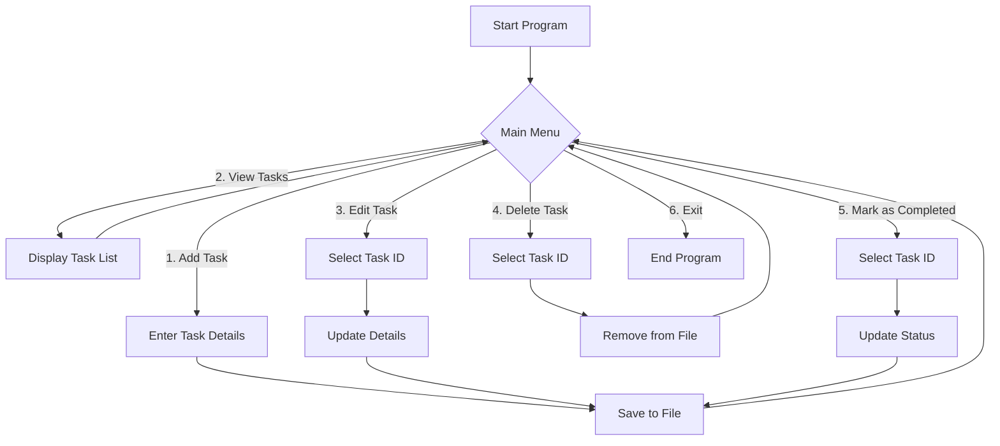

# 📝 To-Do List Mini Project

A simple Java-based To-Do List application that lets you manage your daily tasks.  
You can **add, edit, delete, mark as completed, filter, and sort tasks**.  
Tasks are saved in a file so they remain available even after restarting the program.  

---

## 🚀 Features
- Add new tasks with priority levels  
- Edit or delete tasks  
- Mark tasks as completed  
- View tasks in a **tabular format**  
- Filter by status (Pending / Completed)  
- Sort by priority or completion status  
- Persistent storage using file handling  

---

## 🛠️ Tech Stack
- **Java (Core)**
- **OOP Concepts** (Enums, Encapsulation, ArrayList)
- **File Handling** (for persistence)
- **CLI (Command-Line Interface)**

---

## 📂 Project Structure
```

TodoListMiniProject/
│── Task.java              # Model class for tasks
│── ToDoListApp.java       # Main application
│── tasks.txt              # Stores tasks (auto-created)
│── README.md              # Project documentation

````

---

## ▶️ How to Run
1. Clone the repository  
   ```bash
   git clone https://github.com/TheLearnerAllTime002/TodoListMiniProject.git


2. Navigate to project folder

   ```bash
   cd TodoListMiniProject
   ```
3. Compile the Java files

   ```bash
   javac *.java
   ```
4. Run the program

   ```bash
   java ToDoListApp
   ```

---

## 📊 Flowchart (Mermaid Diagram)



---

## 📸 Sample Output

```
+----+---------------------+------------+------------+----------+
| ID |     Description     |  Priority  |   Status   | Created  |
+----+---------------------+------------+------------+----------+
| 1  | Complete Java HW    | HIGH       | PENDING    | 2025-08-24 |
| 2  | Buy groceries       | MEDIUM     | COMPLETED  | 2025-08-23 |
+----+---------------------+------------+------------+----------+
```

---

## 🌟 Future Improvements

* GUI version using **JavaFX / Swing**
* Due dates & reminders
* Export tasks to **CSV/Excel**
* Cloud sync support

---

## 👤 Author

* [Arjun (TheLearnerAllTime002)](https://github.com/TheLearnerAllTime002)

---


Do you want me to **add another diagram** (like a **class diagram** of `Task` and `ToDoListApp`) in the README too, or just keep the flowchart?
```
